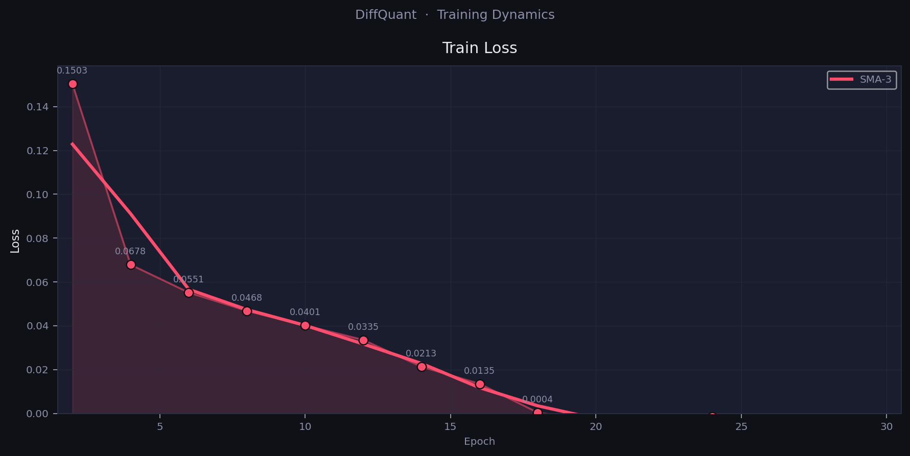
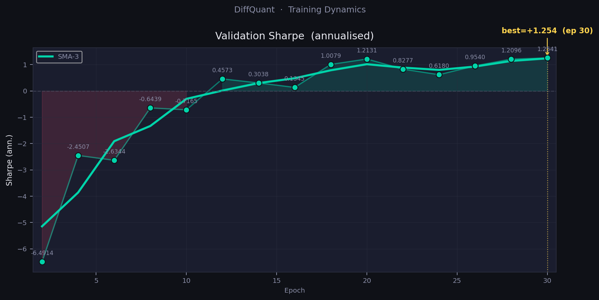
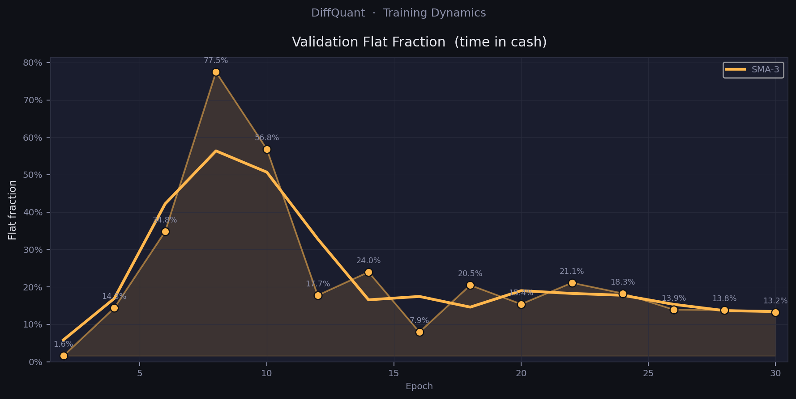
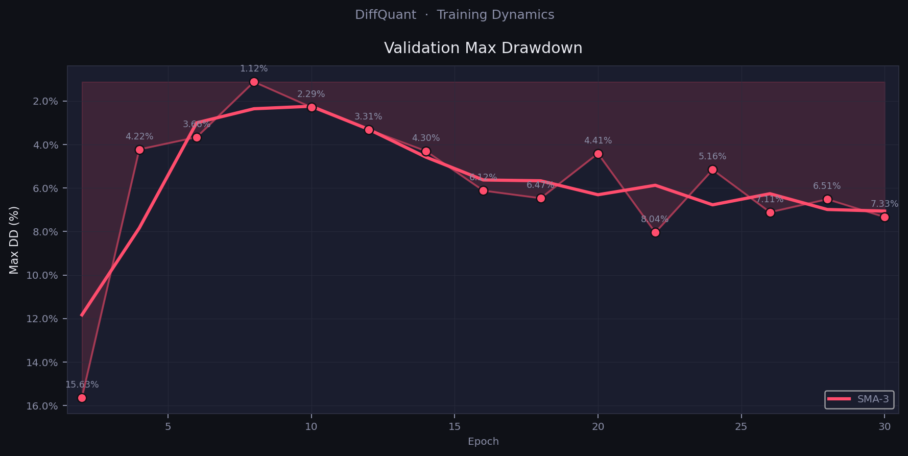
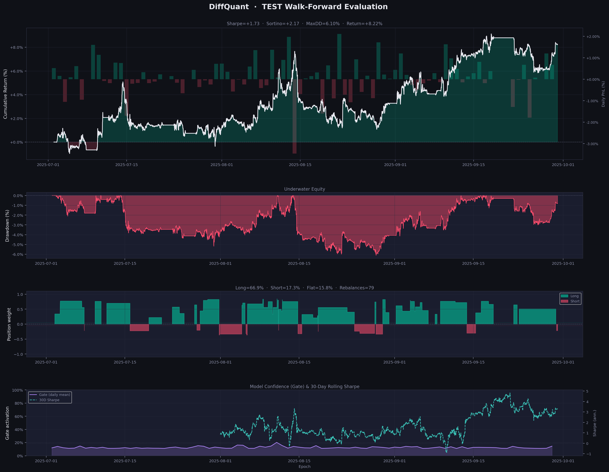
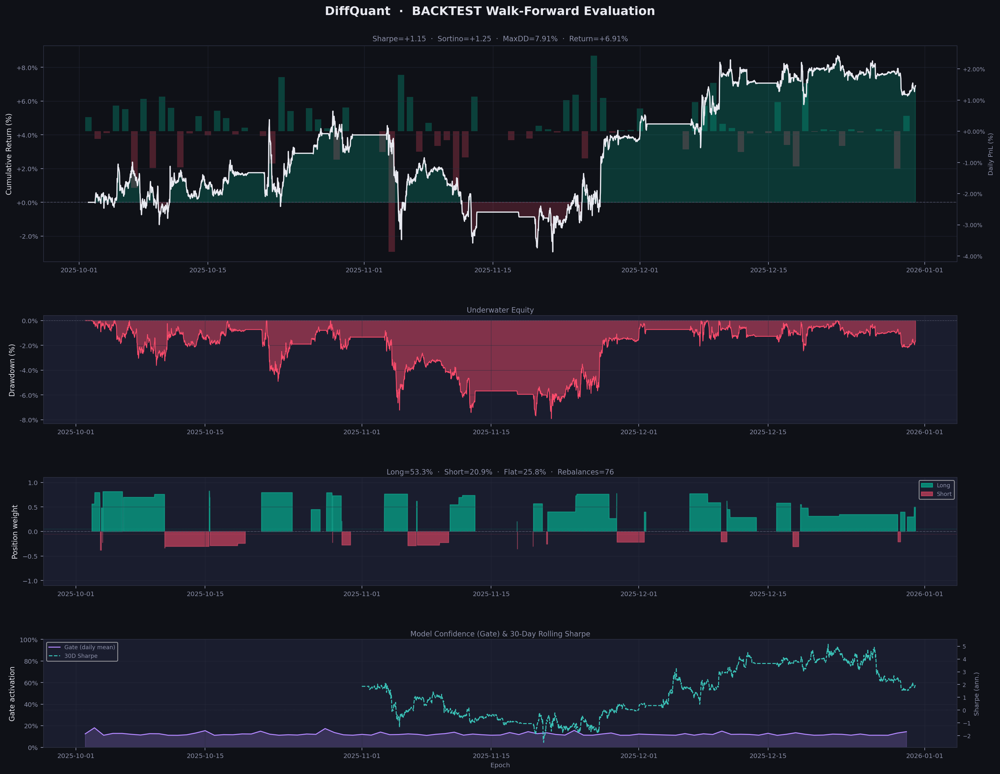
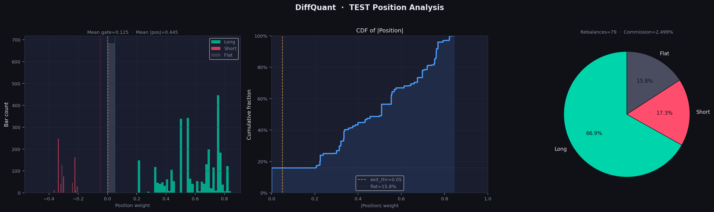
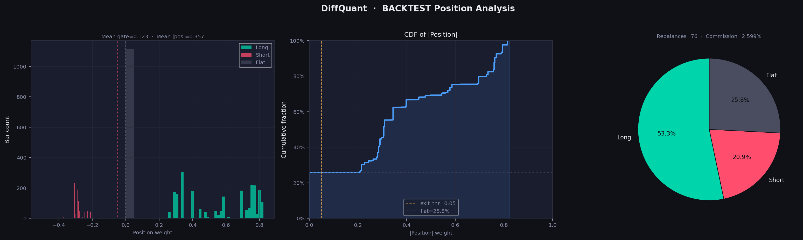

# DiffQuant

### End-to-End Differentiable Trading Pipeline

[](https://python.org)
[](https://pytorch.org)
[](LICENSE)

---

## Contents

- [How it works](#how-it-works)
- [Validation protocol](#validation-protocol)
- [Quick start](#quick-start)
- [Structure](#structure)
- [Experiments](#experiments)
- [Configuration](#configuration)
- [Dataset](#dataset)
- [Experimental status](#experimental-status)
- [Results](#results)
- [Limitations](#limitations)
- [Roadmap](#roadmap)
- [Related work](#related-work)
- [Citation](#citation)

---

Every ML trading system faces the same structural gap: the model optimises a
proxy — MSE, cross-entropy, TD-error — while performance is measured in
realised PnL. The better the proxy fits, the less it guarantees about actual
returns.

DiffQuant closes this gap by design. The pipeline — from raw market features
through a differentiable mark-to-market simulator to the Sharpe ratio — is a
single computation graph. `loss.backward()` optimises what the strategy
actually earns, not a surrogate for it.

📄 **Research article (English · Medium):**
[DiffQuant: Closing the Proxy Gap — Direct Sharpe Optimisation for Algorithmic Trading](article scheduled for release)

📄 **Статья (Русский · Habr):**
[DiffQuant: прямая оптимизация коэффициента Шарпа вместо предсказания цен](статья готовится к публикации)
---

## How it works

The full pipeline is a single differentiable computation graph:
features[t−ctx:t] → PolicyNetwork → position_t → DiffSimulator → −Sharpe → ∂/∂θ

The simulator implements exact mark-to-market accounting as tensor operations —
no surrogate losses, no reward shaping. The entire chain is differentiable:
ret_t      = (close_t − close_{t−1}) / close_{t−1}
gross_t    = position_{t−1} × ret_t
cost_t     = smooth_abs(Δpos_t) × (commission + slippage)
net_pnl_t  = gross_t − cost_t

`smooth_abs(x) = √(x² + ε)` replaces `|x|` to preserve C∞ differentiability
through transaction cost computation — critical when the model is near-flat.

### Policy head: direction × gate
```python
position = tanh(direction_raw / τ_dir) × sigmoid(gate_raw / τ_gate)
```

`direction` encodes the alpha signal; `gate` encodes whether to trade at all.
When confidence is low, `gate → 0` and `position → 0` regardless of direction.
This is the differentiable analogue of action masking. Gate bias is initialised to −1.0, ensuring the model starts in a cautious near-flat regime and only opens positions when accumulated gradient evidence justifies the exposure. This stabilises the early training phase when policy outputs are noisy.

### Training objective
```python
L = λ₁·(−Sharpe) + λ₂·turnover + λ₃·drawdown + λ₄·terminal_position
```

Each penalty term addresses a specific failure mode of pure Sharpe optimisation:
turnover prevents commission drag, drawdown discourages extended underwater
periods, terminal penalises carrying open risk into the next window.

---

## Validation protocol

Both training validation and backtest use continuous walk-forward evaluation —
the same mechanics as live execution:
```python
for t in range(ctx_len, N):
    window   = features[t − ctx : t]       # past ctx bars only
    position = model(normalize(window))     # single forward pass
    pnl_t    = prev_pos × ret_t − commission × |Δpos|
    # position carried to next bar — no resets
```

The same `WalkForwardEvaluator` runs during training (every `val_freq` epochs)
and at final evaluation. There is no separate validation logic anywhere else
in the codebase — this is intentional.

---

## Quick start
```bash
git clone https://github.com/YuriyKolesnikov/diffquant
cd diffquant
pip install -r requirements.txt

# Download 1-min BTCUSDT 2021–2025 from HuggingFace
huggingface-cli download ResearchRL/diffquant-data --local-dir data_source/ --repo-type dataset

# Verify gradient flow and trend learning before training
python sanity_check.py --config configs/experiments/itransformer_hybrid.py
# Expected output:
#   PASS  gradient_flow    all params receive gradient
#   PASS  long_bias        mean_position=+0.19  expected_sign=+
#   PASS  short_bias       mean_position=-0.16  expected_sign=-
#   ALL PASSED
# Expected output:
#   PASS  gradient_flow    all params receive gradient
#   PASS  long_bias        mean_position=+0.19  expected_sign=+
#   PASS  short_bias       mean_position=-0.16  expected_sign=-
#   ALL PASSED

# Train primary experiment
python train.py --config configs/experiments/itransformer_hybrid.py --device cuda

# Finding the best thresholds on the VAL dataset
python optimize_thresholds.py --config configs/experiments/itransformer_hybrid.py --trials 100 --objective sharpe

# Evaluate on held-out test and backtest splits
python evaluate.py --config configs/experiments/itransformer_hybrid.py

# Evaluate on held-out test and backtest splits + final model
python evaluate.py --config configs/experiments/itransformer_hybrid.py --checkpoint output/itransformer_hybrid/models/final.pth

# Optuna — hyperparameter search in debug config
python optimize.py --config configs/experiments/itransformer_hybrid.py --trials 100

# Compare all completed experiments
python compare.py
```

---

## Structure

```
diffquant/
├── configs/
│   ├── base_config.py          # MasterConfig — single source of all hyperparameters
│   └── experiments/            # One file per experiment; overrides selectively
├── data/
│   ├── pipeline.py             # load_or_build() — MD5-cached dataset construction
│   ├── aggregator.py           # 1-min → N-min, clock-aligned resampling
│   ├── features.py             # Log-returns, volume ratios, cyclic time encoding
│   ├── splitter.py             # Temporal split by datetime boundary
│   ├── dataset.py              # TradingDataset (full ctx+hor sequences)
│   └── normalization.py        # Per-sample z-score, no look-ahead
├── model/
│   ├── backbone/
│   │   ├── itransformer.py     # Channel-wise attention (Liu et al., ICLR 2024)
│   │   └── lstm_encoder.py     # Bidirectional LSTM encoder
│   ├── policy_head.py          # direction × gate two-headed output
│   └── policy_network.py       # Backbone + head → position ∈ (−1, +1)
├── simulator/
│   ├── diff_simulator.py       # Mark-to-market PnL, smooth_abs, SimConfig
│   └── losses.py               # sharpe / sortino / hybrid
├── training/
│   └── trainer.py              # DiffTrainer — episode rollout + walk-forward val
├── evaluation/
│   ├── walk_forward.py         # Continuous evaluation engine (val + backtest)
│   └── backtest.py             # Full reporting wrapper
├── utils/
│   ├── metrics.py              # All financial metrics — one location
│   ├── logging_utils.py        # MetricsLogger — val JSONL + full reports
│   ├── utils.py                # Auxiliary functions
│   └── visualization.py        # Equity curves, position distribution
├── sanity/
│   └── checks.py               # Gradient flow + trend bias checks
├── train.py
├── evaluate.py
├── sanity_check.py
├── optimize.py                 # Optuna hyperparameter search
├── optimize_thresholds.py      # Optuna Finding the best thresholds on the VAL dataset
└── compare.py                  # Experiment comparison table
```

---

## Experiments

| Config | Backbone | Loss | Purpose |
|---|---|---|---|
| `itransformer_sharpe` | iTransformer | −Sharpe only | Ablation: loss function contribution |
| `itransformer_hybrid` | iTransformer | Hybrid | **Primary experiment** |
| `lstm_hybrid` | LSTM (bidir.) | Hybrid | Backbone comparison |

The three configs share the same data, simulator, and evaluation protocol.
Any performance difference is attributable to the architecture or loss alone.

---

## Configuration
```python
# Minimal override example
from configs.base_config import MasterConfig

cfg = MasterConfig(experiment_name="itransformer_hybrid")
cfg.backbone.type          = "itransformer"
cfg.loss.type              = "hybrid"
cfg.loss.lambda_turnover   = 0.01
cfg.data.preset            = "ohlcv"       # open, high, low, close, volume
cfg.data.add_time_features = True           # sin/cos hour + sin/cos day-of-week
cfg.data.timeframe_min     = 5             # aggregate 1-min source to 5-min bars

```

Feature presets: `"ohlc"` | `"ohlcv"` (default) | `"full"` | `"custom"`.

---

## Dataset

| | |
|---|---|
| Asset | BTCUSDT Binance Futures (USDⓈ-M perpetual) |
| Source resolution | 1-minute bars (close-time convention) |
| HuggingFace | [`ResearchRL/diffquant-data`](https://huggingface.co/datasets/ResearchRL/diffquant-data) |
| Period | 2021-01-01 — 2025-12-31 |

Temporal splits (all non-overlapping):

| Split | Period | Purpose |
|---|---|---|
| Train    | 2021-01-01 → 2025-03-31 | Gradient updates |
| Val      | 2025-04-01 → 2025-06-30 | Model selection during training |
| Test     | 2025-07-01 → 2025-09-30 | Out-of-sample evaluation |
| Backtest | 2025-10-01 → 2025-12-31 | Final held-out evaluation |

Aggregation from 1-min to any target timeframe uses `origin="epoch"` alignment,
ensuring bars always land on clock boundaries (:00, :05, :10, … for 5-min).
Context window at 5-min resolution: 96 bars (8 hours). Horizon: 24 bars (2 hours).

---

## Experimental status

DiffQuant is an active research project. The results below represent the first
promising configuration found during initial experimentation. The pipeline is
**highly sensitive to hyperparameters** — loss weights, learning rate, training
window, and data features all interact non-trivially. Results will vary across
configurations and market regimes. Reproducing or improving them requires
systematic experimentation, which the codebase is designed to support.

This is research, not a production-ready system.

---

## Results

### Experiment: `itransformer_hybrid`

**Configuration summary:**
- Backbone: iTransformer (d_model=32, n_layers=4) — 52K parameters
- Features: ohlcv + rolling_vol (6 channels), 30-min bars
- Training data: Jan 2024 → Mar 2025 (15 months, 910 non-overlapping samples)
- Loss: Hybrid (Sharpe + drawdown + flat_target + bias)
- Training: 30 epochs, lr=1e-3, mirror_augmentation=True

**Why small model, short window, and non-overlapping samples:**
910 samples is intentionally small. With `stride=horizon_len=24` (non-overlapping
episodes), each training sample covers a distinct 12-hour market window, preventing
the model from memorising sequential price paths. A 52K-parameter model on 910
samples is deliberately capacity-constrained to resist microstructure noise.

The 15-month training window (Jan 2024 – Mar 2025) keeps the training regime
temporally close to the evaluation periods, reducing distribution shift. Extending
to earlier data is straightforward via `SplitConfig.train_start` and is the
recommended first ablation step.

### Training dynamics

| Epoch | Val Sharpe | Val Return | Flat% | Turnover/bar |
|---|---|---|---|---|
| 2 | −6.49 | −14.1% | 1.6% | 0.0335 |
| 10 | −0.72 | −1.1% | 56.8% | 0.0002 |
| 20 | +1.21 | +5.2% | 15.4% | 0.0101 |
| 30 | **+1.25** | +5.8% | 13.2% | 0.0135 |

<p align="center">
  
  
</p>

<p align="center">
  
  
</p>

Best checkpoint saved at epoch 30 — val Sharpe still improving at run end,
indicating the model had not yet converged.

### Walk-forward evaluation

All evaluation uses the continuous walk-forward protocol — identical to
live execution mechanics. No look-ahead, no episode resets.

**Test — July–September 2025 (3 months, out-of-sample)**

| Metric | Value |
|---|---|
| Sharpe (ann.) | **+1.735** |
| Sortino (ann.) | **+2.173** |
| Calmar | 1.346 |
| Total return | +8.22% |
| Max drawdown | 6.10% |
| Commission paid | 2.50% |
| Rebalances | 79 |
| Long / Short / Flat | 66.9% / 17.3% / 15.8% |

**Backtest — October–December 2025 (final hold-out, never touched during training)**

| Metric | Value |
|---|---|
| Sharpe (ann.) | **+1.152** |
| Sortino (ann.) | **+1.250** |
| Calmar | 0.874 |
| Total return | +6.91% |
| Max drawdown | 7.91% |
| Commission paid | 2.60% |
| Rebalances | 76 |
| Long / Short / Flat | 53.3% / 20.9% / 25.8% |

<p align="center">
  
</p>

<p align="center">
  
</p>

<p align="center">
  
  
</p>

### Key observations

**Positive Sharpe on both held-out periods.** Test (+1.73) and backtest (+1.15)
are both positive — this is the primary result. A single positive out-of-sample
period can be coincidence; consistency across two non-overlapping quarters
is a stronger signal.

**Asymmetric learning from symmetric data.** The model was trained exclusively
on Jan 2024 – Mar 2025 data — a predominantly bullish period for BTC.
With `mirror_augmentation=True`, the training loop augments 50% of batches by
inverting price returns, forcing the model to learn symmetric long/short behaviour.
The result: 17–21% short exposure in evaluation, despite the long-biased training
regime. Without augmentation, all previous experiments produced `short_fraction=0`.

**Direction accuracy near 50%.** Long correct: 50.1–51.2%, short correct: 48.8–52.6%.
The model's edge does not come from directional prediction accuracy but from
**asymmetric sizing** — `correct_avg_ret` (+0.065%) systematically exceeds
`incorrect_avg_ret` (−0.061%) in magnitude. The gate mechanism selectively
suppresses low-confidence trades, improving the signal-to-noise ratio of
executed positions.

**Gate activation remains low.** Mean gate ≈ 0.12–0.13. The model spends the
majority of its time at partial exposure rather than full commitment. This is
consistent with a conservative risk posture driven by `lambda_bias` and
`flat_target` regularisation.

---

## Limitations

**Single asset.** The pipeline trains one model per instrument.
Multi-asset portfolio construction requires architectural extension.

**Flat commission model.** Costs are `commission_rate + slippage_rate` applied
uniformly. For positions large enough to move price, enable `market_impact_eta`
in `SimulatorConfig` (quadratic Almgren-Chriss term).

**Intraday only.** Context window is 8 hours; horizon is 2 hours. The pipeline
is not designed for multi-day holding periods or overnight risk.

**Research framework.** There is no live execution layer. Connecting to a broker
API requires additional engineering outside the scope of this project.

---

## Roadmap

The following directions are planned for future development, roughly in order
of research priority:

**Multi-asset portfolio extension.**
The current architecture optimises a single instrument. Extending to a portfolio
requires a cross-asset attention layer and a portfolio-level Sharpe objective
that accounts for correlation between positions. The differentiable simulator
generalises naturally: `gross_t = Σ weights_{i,t-1} × ret_{i,t}`.

**Richer loss functions.**
The hybrid loss is still a first approximation. Planned extensions include
Calmar-based objectives, conditional drawdown penalties, and regime-aware
loss weighting that adjusts λ values based on detected volatility regime.

**Additional backbones.**
The LSTM encoder is implemented but not yet benchmarked against iTransformer
under identical conditions. Planned ablations include PatchTST, Mamba, and
linear attention variants.

**Online data pipeline.**
A scheduled data collection layer (Binance WebSocket → local store → feature
pipeline → model inference) to support paper trading and live monitoring.

**Execution and risk layer.**
A broker-facing execution module with position sizing, stop-loss enforcement,
and exchange connectivity. This is the final step before any live deployment
and is outside the current research scope.

---

## Related work

**Buehler, H., Gonon, L., Teichmann, J., Wood, B. (2019).
[Deep Hedging.](https://arxiv.org/abs/1802.03042)
*Quantitative Finance*, 19(8), 1271–1291.**
The foundational framework for training neural network policies end-to-end
through a differentiable financial objective. DiffQuant adapts this paradigm
from derivatives hedging to directional alpha generation.

**Liu, Y., Hu, T., Zhang, H., Wu, H., Wang, S., Ma, L., Long, M. (2024).
[iTransformer: Inverted Transformers Are Effective for Time Series Forecasting.](https://arxiv.org/abs/2310.06625)
*ICLR 2024 Spotlight.***
The backbone used in the primary DiffQuant experiment. Treats each feature
channel as a token — capturing cross-variable dependencies rather than
local temporal patterns.

**Moody, J., Saffell, M. (2001).
[Learning to trade via direct reinforcement.](https://ieeexplore.ieee.org/document/935097)
*IEEE Transactions on Neural Networks*, 12(4), 875–889.**
The original formulation of direct PnL optimisation as a training objective,
predating the deep learning era. DiffQuant extends this to a fully
differentiable end-to-end pipeline with modern architectures.

**Khubiev, K., Semenov, M., Podlipnova, I., Khubieva, D. (2026).
[Finance-Grounded Optimization For Algorithmic Trading.](https://arxiv.org/abs/2509.04541)
*arXiv:2509.04541.***
The closest parallel work: introduces Sharpe, PnL, and MaxDD as training
loss functions for return prediction. DiffQuant differs by coupling the
loss to a fully differentiable simulator — gradient flows through
the trading mechanics, not just through a prediction head.

---

## Citation
```bibtex
@software{Kolesnikov2026diffquant,
  author  = {Kolesnikov, Yuriy},
  title   = {{DiffQuant}: End-to-End Differentiable Trading Pipeline},
  year    = {2026},
  url     = {https://github.com/YuriyKolesnikov/diffquant},
  version = {0.1.0}
}
```

---

*MIT License. See [LICENSE](LICENSE).*
